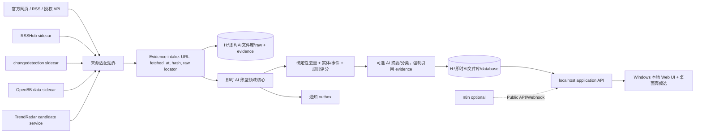

# 六仓架构对比

状态：`R0_STATIC_COMPLETE / RUNTIME_PARTIAL`。

## 架构定位

| 项目 | 技术栈与形态 | 核心控制流 | 存储 | 扩展面 | Windows 适配 | 维护难度 |
|---|---|---|---|---|---|---|
| TrendRadar | Python 批处理 + 静态 HTML + 可选 FastMCP | `NewsAnalyzer.run` 编排抓取、保存、规则/AI、报告、推送 | 每日 news/RSS SQLite，可选 S3 | 配置、RSS、StorageBackend、webhook、MCP；无动态插件 ABI | Python/bat 可原生，依赖尚未安装 | 中；主编排集中且无测试资产 |
| RSSHub | TypeScript/Node + Hono 的请求驱动路由服务 | HTTP 请求匹配 namespace/route → handler → RSS 输出与缓存 | 缓存而非历史业务库 | 数千 route 文件、中间件、缓存 | Node 可原生，未运行 | 高；路由生态大且来源变动频繁 |
| changedetection.io | Python Flask + ticker/priority queue/worker | watch 调度 → fetcher → processor/diff → history → notification | JSON + 每 watch 内容/图像历史 | Pluggy fetcher/processor、REST、RSS、Apprise | Python 可原生；浏览器抓取常需外部服务 | 中高；应用内部耦合但服务边界清晰 |
| OpenBB | Python 扩展平台 + FastAPI/CLI/MCP；另有 Tauri 管理器 | Router/CommandRunner → QueryExecutor → Provider/Fetcher TET → OBBject | 结果主要在内存；设置、导出和 Provider 局部缓存 | entry points、Provider、标准模型、REST/MCP | Python 原生候选；桌面构建重 | 高；Provider 面广但核心边界优秀 |
| Folo | Electron/React 客户端 + Expo/SSR/CLI | Electron main/preload → React/store → 外部 Folo API → 本地缓存 | WA-SQLite/IndexedDB、localStorage、Electron Store | SDK、IPC、OPML、integrations；核心服务端不在仓库 | Windows 打包链成熟 | 高；多端 monorepo、远端耦合和安全整改大 |
| n8n | Node/TypeScript + Express + Vue 工作流平台 | trigger/webhook → WorkflowRunner → regular/queue → WorkflowExecute → nodes | SQLite/Postgres + execution/binary storage | built-in/custom/community nodes、API/Webhook/MCP | Web 服务可原生；monorepo/native 依赖重 | 很高；通用平台和供应链面巨大 |

## 关键调用链对比

```text
TrendRadar: source -> DataFetcher/RSSFetcher -> StorageBackend -> rules/AI -> report -> notify
RSSHub:      HTTP route -> handler/context -> cache/transform -> RSS response
changed:    ticker/API -> priority queue -> worker -> fetcher -> processor/diff -> history -> Apprise
OpenBB:     command -> Query -> Provider registry -> Fetcher TET -> standard Data -> OBBject/API
Folo:       Electron/React -> client SDK -> api.folo.is -> local cache -> reader/UI
n8n:        trigger/API -> WorkflowRunner -> WorkflowExecute -> nodes -> execution persistence/output
```

六条链各自解决不同层次问题。把它们直接拼接或复制到一个目录，会同时引入数据模型冲突、生命周期冲突、六种存储语义和强许可证混合。

## 目标能力的最佳来源

| 目标层 | 最有价值的现成实现 | 采用判断 |
|---|---|---|
| 热点采集/关键词降噪/报告 | TrendRadar | 条件 `CORE_FORK_CANDIDATE` 或独立服务；同时重写少量通用模式 |
| Feed 转换 | RSSHub | localhost sidecar，只启用白名单路由 |
| 官方网页变化 | changedetection.io | localhost sidecar，经 REST/RSS 输出变化事件 |
| 结构化金融数据 | OpenBB | 最小 Provider/API sidecar，结果转自有 schema |
| 阅读工作台 | Folo | 只作 `UI_REFERENCE`，不复用代码和图标 |
| 外围自动化 | n8n | MVP 后的用户可选 sidecar，不进入核心数据路径 |
| 长期证据、实体/事件、跨源去重 | 六仓均不完整 | 即时 AI 必须拥有薄型领域核心和正式数据模型 |

## 推荐的边界架构



架构原则：上游服务保留自己的许可证、进程、配置和临时数据；正式事实和证据只通过定义明确的适配器进入即时 AI。任何 AI 输出都回指原始 URL、抓取时间、内容 hash 和证据文件。

## Windows 与存储结论

- 目标运行形态是“本地 API/worker + Web 阅读界面 + 桌面壳”，但 R0 不锁定 Tauri/Electron/PySide6。
- Folo 证明 Electron 阅读器工程成熟，但其弱隔离窗口配置不可继承；OpenBB 证明 Tauri 可管理本地后端，但其界面不是阅读器。
- 正式业务根固定为 `H:\即时AI文件库`。上游 cache/runtime 与正式 `raw/evidence/database` 分开，C 盘仅保留小型程序和用户级安全配置。
- SQLite + FTS5 是 MVP 候选而非最终锁定；原文和附件使用内容寻址文件，数据库保存索引、实体、事件和证据引用。

## 未验证项

除 TrendRadar 的无依赖失败启动外，六仓均未达到运行验证。端口、内存、下载量、Windows 原生依赖、真实数据质量和服务停止/恢复仍需按优先级逐项试验。
