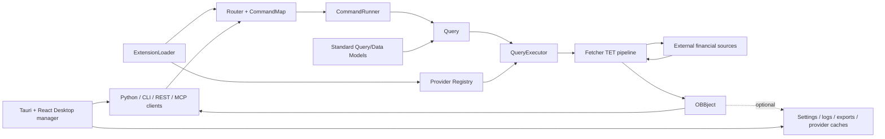

# OpenBB 源码架构

研究锚点：`OpenBB-finance/OpenBB`，提交 `3e071fcc2cd9f891cac6040ae60296dba76dab46`，`OFFICIAL_ARCHIVE_SNAPSHOT`，无 `.git`。

## 架构结论

OpenBB 的核心是“扩展发现 + 路由/标准模型 + provider 执行器”。业务 extension 声明统一命令；provider extension 实现相同标准模型的具体 Fetcher；核心在启动时从 Python entry points 发现两者，生成 Python SDK 和 FastAPI 路由。CLI、REST、Workspace backend 与 MCP 是消费同一命令图的不同表面。

桌面代码不是财经研究终端本身，而是 Tauri/React 编写的环境与后端服务管理器：首次安装 Miniforge 环境，生成环境 YAML，并预设 `openbb-api` 和 `openbb-mcp` 本地服务。

## 文字架构图

```text
Python / CLI / REST / Workspace / MCP 客户端
                |
        Router / CommandMap
                |
          CommandRunner
                |
   extension command -> Query -> QueryExecutor
                |             |
       Standard Model    Provider Registry
                              |
                         Provider.fetcher_dict
                              |
       transform_query -> extract_data -> transform_data
                              |
              外部 API / 官方数据 / 第三方库 /网页
                              |
                OBBject(results, provider, warnings,
                        chart, extra.metadata)
                              |
        内存结果 / 可选导出 / 局部 HTTP 或 SQLite 缓存
```

辅助表面：

```text
Tauri + React Desktop
  -> 安装/管理 Miniforge 环境
  -> 读写 ~/.openbb_platform 配置
  -> 启停 openbb-api:6900、openbb-mcp:8001、Jupyter
```

## Mermaid 架构图



## 分层说明与源码证据

### 1. 扩展发现

- `openbb_platform/core/openbb_core/app/extension_loader.py`
  - `OpenBBGroups` 固定三组 entry points：`openbb_core_extension`、`openbb_provider_extension`、`openbb_obbject_extension`。
  - `ExtensionLoader._load_entry_points()` 将 core 扩展加载为 `Router`，provider 扩展加载为 `Provider`，OBBject 扩展加载为 `Extension`。
- 验证：`SOURCE_VERIFIED`。

### 2. 命令与 API 路由

- `openbb_platform/core/openbb_core/app/router.py`
  - `Router.command()` 把 extension 函数变成 FastAPI route，并注入 provider choices、标准参数、额外参数和返回 schema。
  - `RouterLoader.from_extensions()` 合并所有 core routers。
- `openbb_platform/core/openbb_core/api/router/commands.py`
  - `add_command_map()` 遍历插件路由，`build_api_wrapper()` 将 route 包装到 `CommandRunner.run()`。
- 验证：`SOURCE_VERIFIED`。

### 3. 查询与 provider 执行

- `openbb_platform/core/openbb_core/app/query.py`
  - `Query.execute()` 合并标准参数和 provider 特有参数，并向 `QueryExecutor` 传递凭据和 preferences。
- `openbb_platform/core/openbb_core/provider/query_executor.py`
  - `execute()` 从 Registry 取得 provider，再由 `fetcher_dict[model_name]` 选择 Fetcher。
- `openbb_platform/core/openbb_core/provider/abstract/fetcher.py`
  - `Fetcher.fetch_data()` 调用 `transform_query()`、`extract_data/aextract_data()`、`transform_data()`。
- 验证：`SOURCE_VERIFIED`。

### 4. 数据模型和结果

- `openbb_platform/core/openbb_core/provider/standard_models/`
  - 180 个标准模型文件定义跨 provider 的 QueryParams 与 Data。
- `openbb_platform/core/openbb_core/app/model/obbject.py`
  - `OBBject` 包含 `results`、`provider`、`warnings`、`chart`、`extra`，并提供 dataframe/polars/numpy/dict/LLM 转换。
- 验证：`SOURCE_VERIFIED`。

### 5. Python 接口

- `openbb_platform/core/openbb/__init__.py`
  - import 时 `PackageBuilder.auto_build()` 对安装扩展生成静态 Python package；`create_app()` 创建 `obb`/`sdk`。
- `openbb_platform/core/openbb_core/app/static/package_builder.py`
  - `PackageBuilder` 根据扩展和 route map 写入 Python 模块与 reference 文件。
- 验证：`SOURCE_VERIFIED`。

### 6. API 和 Workspace backend

- `openbb_platform/core/openbb_core/api/rest_api.py`
  - 创建 FastAPI app、CORS、路由和异常处理；模块直接运行时启动 Uvicorn。
- `openbb_platform/extensions/platform_api/openbb_platform_api/main.py`
  - `openbb-api` 复用核心 app，并增加 `/widgets.json`、`/apps.json`、`/agents.json`；默认 `127.0.0.1:6900`。
- 验证：`SOURCE_VERIFIED`。

### 7. MCP

- `openbb_platform/extensions/mcp_server/openbb_mcp_server/app/app.py`
  - 基于 FastMCP 处理 FastAPI routes，读取 route 的 `mcp_config`，按类别暴露工具/资源/提示。
- `openbb_platform/extensions/mcp_server/openbb_mcp_server/models/settings.py`
  - `MCPSettings` 控制类别、发现、缓存、认证、HTTP client、端口和 skills providers；默认 `127.0.0.1:8001`。
- 验证：`SOURCE_VERIFIED`。

### 8. 桌面

- `desktop/src/main.tsx`：React 前端入口。
- `desktop/src-tauri/src/main.rs`：Tauri 主入口、系统托盘、更新器和命令注册。
- `desktop/src-tauri/src/tauri_handlers/startup.rs`：下载/安装 Miniforge、生成 `openbb.yaml`、建立 API/MCP 默认后端。
- `desktop/src-tauri/tauri.windows.conf.json`：Windows NSIS `currentUser` 安装目标。
- 验证：`SOURCE_VERIFIED`。

## 未发现或不属于核心的组件

- 调度器：没有通用 cron/APScheduler/Celery 服务。CLI `.openbb` routine 是命令脚本解析与执行，不是内建定时调度。
- AI：没有 OpenAI/Anthropic 推理实现；MCP 和 `to_llm()` 只提供数据给外部智能体。
- 通知：没有邮件、IM、移动推送主模块。
- 中心数据库：没有承载全量新闻/事件历史的中心 ORM 或数据库服务。
- 网页变化监控：未发现同 changedetection.io 类似的 diff/watch 引擎。

以上为 `SOURCE_VERIFIED` 的“未在 core/extensions/CLI 搜索与调用链中发现”，不能证明仓库外商业产品没有这些能力。
