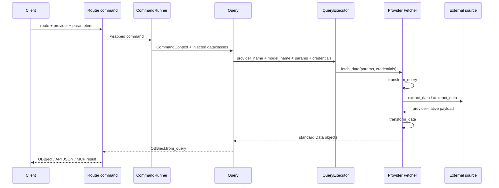

# OpenBB 数据流

研究锚点：`OpenBB-finance/OpenBB`，提交 `3e071fcc2cd9f891cac6040ae60296dba76dab46`，`OFFICIAL_ARCHIVE_SNAPSHOT`，无 `.git`。

## 真实主链

```text
调用者（Python / CLI / REST / MCP）
→ extension Router command
→ CommandRunner / Query
→ ProviderInterface 动态参数模型
→ QueryExecutor 选择 Provider + Fetcher
→ Fetcher.transform_query
→ Fetcher.extract_data / aextract_data
→ 外部金融数据源
→ Fetcher.transform_data
→ 标准 Data 模型
→ OBBject
→ dataframe / dict / JSON / chart / LLM JSON
```

## Mermaid



## 分阶段源码定位

### 1. 路由与参数注入

- `openbb_platform/core/openbb_core/app/router.py::Router.command`
  - 把 `model="CompanyNews"` 等模型名写入 route 的 `openapi_extra`。
  - `SignatureInspector.complete()` 注入 provider choices、standard params、extra params 和返回 annotation。
- `openbb_platform/extensions/news/openbb_news/news_router.py::company/world`
  - 两个函数都调用 `OBBject.from_query(Query(**locals()))`。

状态：`SOURCE_VERIFIED`。

### 2. 用户参数与凭据

- `openbb_platform/core/openbb_core/app/query.py::Query.execute`
  - 过滤 provider 不支持的 extra params。
  - 从 `CommandContext.user_settings.credentials` 取凭据，从 preferences 取 HTTP/缓存偏好。
- `openbb_platform/core/openbb_core/app/model/credentials.py::CredentialsLoader`
  - 凭据来源包括 `user_settings.json` 和环境变量；运行时用 `SecretStr` 包装。

状态：`SOURCE_VERIFIED`。

### 3. Provider 选择

- `openbb_platform/core/openbb_core/provider/registry.py::RegistryLoader.from_extensions`
  - 从 provider entry points 载入 `Provider`。
- `openbb_platform/core/openbb_core/provider/query_executor.py::QueryExecutor.execute`
  - `get_provider(provider_name)` → `get_fetcher(provider, model_name)` → 过滤凭据 → `fetcher.fetch_data()`。

状态：`SOURCE_VERIFIED`。

### 4. 抽取和标准化

- `openbb_platform/core/openbb_core/provider/abstract/fetcher.py::Fetcher.fetch_data`
  - 固定 TET：`transform_query` → `extract_data/aextract_data` → `transform_data`。
- `openbb_platform/core/openbb_core/provider/standard_models/company_news.py`
  - `CompanyNewsData` 标准字段：date/title/author/excerpt/body/images/url/symbols。
- `openbb_platform/providers/fmp/openbb_fmp/models/company_news.py`
  - `FMPCompanyNewsFetcher.aextract_data()` 请求 FMP URL，`transform_data()` 校验为 `FMPCompanyNewsData`。
- `openbb_platform/providers/yfinance/openbb_yfinance/models/company_news.py`
  - `YFinanceCompanyNewsFetcher` 在线程中调用 `Ticker.get_news()`，抽取 canonical/click-through URL 后标准化。

状态：`SOURCE_VERIFIED`，外部请求未运行。

### 5. 结果封装

- `openbb_platform/core/openbb_core/app/model/obbject.py::OBBject.from_query`
  - 执行 Query 并将数据放进 `results`；AnnotatedResult 元数据放进 `extra.results_metadata`。
- `openbb_platform/core/openbb_core/app/command_runner.py::StaticCommandRunner.run`
  - 附加 provider、route、参数、耗时和 timestamp 元数据，并触发可选 output callbacks。
- `OBBject.to_dataframe/to_dict/to_llm`
  - 只做视图/序列化转换；没有持久化或 AI 推理。

状态：`SOURCE_VERIFIED`。

## 与目标情报流水线的逐项比较

| 目标阶段 | OpenBB 实现 | 结论 |
|---|---|---|
| 信息源 | 32 个 provider 包 | 强，结构化金融数据为主 |
| 抓取 | 各 Fetcher 自行调用 API/库/网页 | 强，但策略和条款分散 |
| 标准化 | 标准 Query/Data 模型 | 很强，可作为数据适配层 |
| 去重 | 未发现新闻级去重主链 | 缺失 |
| 分类/实体识别 | 标准字段和 provider tags，不是事件分类引擎 | 基本缺失 |
| AI 分析 | MCP/LLM JSON 出口，无模型执行 | 缺失 |
| 存储 | 内存结果、设置/日志/导出/局部缓存 | 不足以承担长期情报库 |
| 报告 | dataframe/chart/Workspace widgets | 有展示接口，无定期情报报告闭环 |
| 推送 | 未发现通知服务 | 缺失 |

## 新闻与证据保存结论

标准新闻模型保留 URL，并允许 excerpt/body/images，因此能把“来源引用”交给下游。但是 Fetcher 的默认返回路径是内存 `OBBject`，没有自动下载原文、哈希快照、写证据目录或去重。接入“即时 AI”时必须由我们自己的采集/证据层持久化到 `H:\即时AI文件库\raw` 和 `evidence`，不能误把 OpenBB cache 当作证据库。
