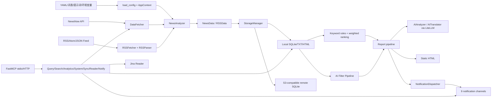

# TrendRadar 源码架构

## 结论

这是“Python 批处理核心 + 静态 HTML + 可选 MCP 服务 + 可选容器定时器”的架构，没有 SPA 前端和常规业务 REST 后端。主批处理与 MCP 共用部分数据/分析代码，但 MCP 另有自己的服务与工具层。

元数据：TrendRadar；提交 `8ee26026ba6c11dec41a95fb3895a7162876caa1`；`OFFICIAL_ARCHIVE_SNAPSHOT`；无 `.git`；静态结论均为 `SOURCE_VERIFIED`，除显式标注外。

## 文字架构图

```text
config.yaml + timeline.yaml + frequency_words/AI prompts + 环境变量
                              |
                load_config / AppContext / Scheduler
                              |
      +-----------------------+-----------------------+
      |                                               |
NewsNow 风格 API                                  RSS/Atom/JSON Feed
DataFetcher                                         RSSFetcher/RSSParser
      |                                               |
      +------------ NewsData / RSSData ----------------+
                              |
             StorageManager / StorageBackend
                |                         |
 LocalStorageBackend                 RemoteStorageBackend
 SQLite + TXT + HTML             临时 SQLite <-> S3 兼容对象存储
                |
   关键词规则 / AI Filter Pipeline / 权重排序
                |
         AIAnalyzer / AITranslator (LiteLLM)
                |
        静态 HTML + NotificationDispatcher
                |
 飞书/钉钉/企微/Telegram/Email/ntfy/Bark/Slack/Generic Webhook

独立入口：FastMCP server
  -> DataQuery / Search / Analytics / Config / System / StorageSync
  -> ArticleReader(Jina Reader) / Notification
  -> 读取同一 output SQLite，亦可触发抓取和通知
```

## Mermaid



## 分层与源码证据

| 层 | 实现 | 关键证据 |
|---|---|---|
| 程序入口 | `trendradar/__main__.py::main`, `NewsAnalyzer` | CLI 解析后加载配置并调用 `NewsAnalyzer.run` |
| 上下文/依赖汇聚 | `trendradar/context.py::AppContext` | 延迟创建存储、调度、通知、AI 筛选管线 |
| 抓取 | `crawler/fetcher.py::DataFetcher`; `crawler/rss/*` | NewsNow JSON、RSS/Atom/JSON Feed 两条路径 |
| 调度 | `core/scheduler.py::Scheduler` | preset/custom、week_map、period、once 记录 |
| 处理 | `core/frequency.py`; `core/analyzer.py` | 规则匹配、权重、关键词/RSS 统计 |
| AI | `ai/client.py`, `analyzer.py`, `filter_pipeline.py`, `translator.py` | LiteLLM 统一调用；分析、分类、翻译三种用法 |
| 存储 | `storage/base.py`, `manager.py`, `local.py`, `remote.py`, `sqlite_mixin.py` | 抽象后端，本地/远程共用 SQLite 实现 |
| 报告 | `report/generator.py`, `report/html.py` | 生成时间快照、latest 和入口 HTML |
| 通知 | `notification/dispatcher.py`, `senders.py`, `splitter.py` | 固定渠道分发、多账号、分片和格式适配 |
| API/MCP | `mcp_server/server.py` 与 `mcp_server/tools/*` | FastMCP resources/tools；stdio 或 HTTP `/mcp` |
| 前端 | 无应用前端；只有生成式静态 HTML | `report/html.py`; Docker `manage.py::start_webserver` 以 `http.server` 托管 `output` |

## 关键架构限制

- `trendradar/__main__.py` 超过 1600 行，主类承担采集、模式策略、AI、报告与推送编排，虽有模块分层但核心协调仍偏集中。
- MCP HTTP 默认参数是 `host=0.0.0.0, port=3333`，源码未见 TrendRadar 自己的鉴权中间件；是否由 FastMCP/部署层提供保护需运行与依赖文档验证。
- Docker 静态 Web 仅展示文件，不是查询 API。常规 API 能力主要是 MCP。

