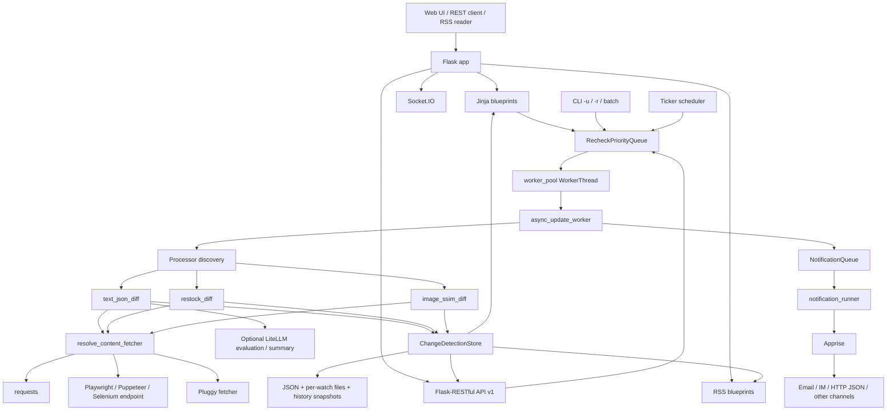

# changedetection.io 源码架构

## 架构结论

该提交是单 Python 应用：Flask/Jinja Web 与 REST API 承担控制面；ticker 与优先队列承担调度；异步 worker 驱动 processor 和 fetcher；文件型 datastore 保存配置与历史；独立通知队列通过 Apprise 输出；Socket.IO 提供 UI 实时状态。浏览器抓取通常连接外部 Playwright/Selenium 服务，而非由桌面进程内置浏览器。

## 文字架构图

```text
浏览器 / REST 客户端 / RSS 客户端
        │
        ├── Flask + Jinja 蓝图（控制与查看）
        ├── Flask-RESTful /api/v1（watch、tag、history、diff、search、import）
        ├── /rss（token 保护的变化 feed）
        └── Socket.IO（检查状态更新）
                         │
      ticker_thread_check_time_launch_checks / 手工/API/CLI 入队
                         │
                  RecheckPriorityQueue
                         │
                 worker_pool.WorkerThread
                         │
                worker.async_update_worker
                         │
       ┌─────────────────┴──────────────────┐
       │ processor 发现/插件                │ fetcher 解析/插件
       │ text_json_diff（默认）              │ requests（默认）
       │ restock_diff                        │ Playwright/Puppeteer/Selenium
       │ image_ssim_diff                     │ 外部 fetcher 插件
       └─────────────────┬──────────────────┘
                         │
        URL 安全校验 → 抓取 → 预处理 → 选择/忽略/条件过滤
                         │
                checksum/processor 判变
                         │
               可选 LLM 意图过滤与摘要
                         │
      ChangeDetectionStore / Watch 文件型原子持久化
                         │
    changedetection.json + {uuid}/watch.json + history/snapshots
                         │
                 NotificationQueue
                         │
       notification_runner → Jinja → Apprise → 外部渠道/API
```

## Mermaid 架构图



## 分层说明与证据

### 程序入口与 Web 层

- `changedetection.py` 只调用 `changedetectionio.main()`。
- `setup.py` 注册 `changedetection.io=changedetectionio:main`，要求 Python `>=3.10`。
- `changedetectionio/__init__.py::main` 解析 CLI/环境、创建 `ChangeDetectionStore`、构造 Flask app，最后由 Socket.IO 或 Flask 启动服务器；Windows 默认数据目录为 `%APPDATA%\changedetection.io`。
- `changedetectionio/flask_app.py::changedetection_app` 注册 REST 资源和所有 UI/RSS 蓝图，并启动 worker、ticker、通知线程与版本检查线程。

### 调度器

`changedetectionio/flask_app.py::ticker_thread_check_time_launch_checks` 每轮：

1. 执行 worker 健康检查；
2. 处理全局 pause；
3. 按 `last_checked` 排序 watch；
4. 应用 watch/global 日程、阈值、jitter 和 proxy reuse；
5. 避免重复运行/重复入队；
6. 以 epoch time 为优先级调用 `worker_pool.queue_item_async_safe`。

### worker 与数据处理

`changedetectionio/worker.py::async_update_worker` 从队列 claim UUID，根据 watch 的 `processor` 调 `processors.get_processor_module`，创建 `perform_site_check`，执行 `call_browser()` 后在线程池内运行 `run_changedetection()`。它随后处理可选 LLM、更新 watch、保存历史/截图/XPath、入通知队列并执行插件 finalize hook。

### 数据源/抓取器

`changedetectionio/content_fetchers/__init__.py::resolve_content_fetcher` 是解析单一入口：watch 配置优先，回退全局；PDF 强制 `html_requests`；browser steps 对某些后端覆盖为 Playwright；未知后端回退 requests。内置 fetcher 为 requests、Playwright/Puppeteer 和 Selenium，并可经 Pluggy 注册外部 fetcher。

### 差异处理

- 默认 `text_json_diff`：RSS/PDF/JSON 预处理，CSS/XPath/JSON 选择，忽略/抽取/排序/去重，再用 MD5 比较；可执行触发文本、自定义条件和全历史唯一行检查。
- `restock_diff`：解析结构化商品 metadata、价格和库存状态。
- `image_ssim_diff`：对截图做像素/SSIM 类型比较；默认由 `DISABLED_PROCESSORS` 禁用。

### 存储

`ChangeDetectionStore` 的正式实现是文件型：全局设置在 `changedetection.json`，watch/tag 分别在 `{uuid}/watch.json`、`{uuid}/tag.json`，历史索引与内容快照也位于 watch 目录。`save_json_atomic` 使用同目录临时文件加 `os.replace`；源码明确多进程不受支持。

### AI

`worker.async_update_worker` 只在已检测变化且存在上一快照时调用 `llm.evaluator.evaluate_change` 和按需 `summarise_change`。`llm.client.completion` 包装 `litellm.completion`；配置支持环境变量或 datastore，含输入上限、token 累计和月度预算。AI 是可选后处理，不是抓取或判变的硬依赖。

### 通知

`NotificationService` 根据 watch→tag→global 级联配置构造通知上下文并放入 `NotificationQueue`；`flask_app.notification_runner` 调 `notification.handler.process_notification`，Jinja 渲染后使用 Apprise。该路径可配置 HTTP/JSON 类出站通知，但未发现独立的入站 webhook 框架。

### API、MCP 与外部依赖

- REST：`/api/v1`，由 `flask_app.py` 注册，OpenAPI 来自 `docs/api-spec.yaml`。
- RSS：`/rss`、`/rss/watch/<uuid>`、`/rss/tag/<uuid>`，使用独立 token。
- MCP：对全快照的 Python/Markdown/YAML/JSON 静态搜索未发现 `MCP` 或 `Model Context Protocol`；结论为“该提交无已定位 MCP 实现”。
- 主要外部依赖：Flask、Flask-SocketIO、requests、Playwright/Pyppeteer/Selenium、BeautifulSoup/lxml、Apprise、LiteLLM、Brotli、OpenAPI Core。

## 架构证据索引

| 结论 | 源码路径 | 类/函数/配置 | 验证状态 |
|---|---|---|---|
| CLI→store→Flask/server | `changedetectionio/__init__.py` | `main` | `SOURCE_VERIFIED` |
| Web/API/后台线程装配 | `changedetectionio/flask_app.py` | `changedetection_app` | `SOURCE_VERIFIED` |
| 周期调度与入队 | `changedetectionio/flask_app.py` | `ticker_thread_check_time_launch_checks` | `SOURCE_VERIFIED` |
| worker 核心调用链 | `changedetectionio/worker.py` | `async_update_worker` | `SOURCE_VERIFIED` |
| fetcher 选择 | `changedetectionio/content_fetchers/__init__.py` | `resolve_content_fetcher` | `SOURCE_VERIFIED` |
| 默认文本判变 | `changedetectionio/processors/text_json_diff/processor.py` | `perform_site_check.run_changedetection` | `SOURCE_VERIFIED` |
| 文件持久化 | `changedetectionio/store/file_saving_datastore.py` | `save_json_atomic`、`FileSavingDataStore` | `SOURCE_VERIFIED` |
| 通知 | `changedetectionio/notification_service.py`、`changedetectionio/notification/handler.py` | `NotificationService`、`process_notification` | `SOURCE_VERIFIED` |
| LLM | `changedetectionio/llm/evaluator.py`、`changedetectionio/llm/client.py` | `evaluate_change`、`summarise_change`、`completion` | `SOURCE_VERIFIED` |

所有证据均对应项目 `dgtlmoon/changedetection.io`、提交 `fce24780e74199bf34c62a0d90188cc2fc12f061`。

