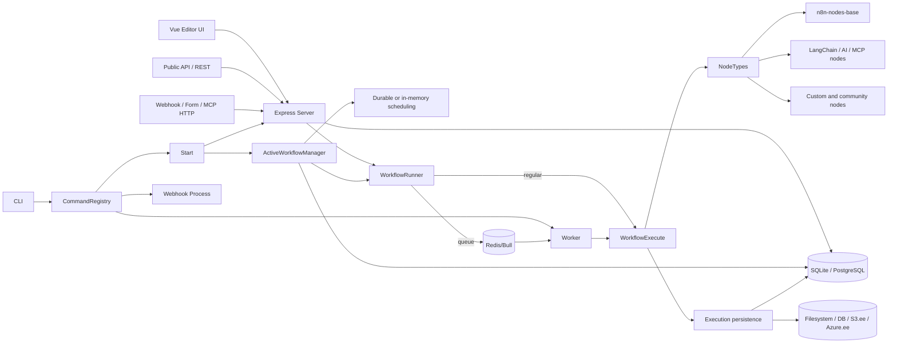

# n8n 源码架构

> 项目/提交：`n8n-io/n8n` @ `7968432083cdc2526b3b08983d84d0dc73176356`。
> 所有结论来自 `upstream/n8n-snapshot-usable`；快照无 `.git`，且排除 `.claude`。
> 它是官方提交归档，不等于完成 Git 克隆。

## 文字架构图

```text
浏览器 Vue Editor / Public API 客户端 / Webhook / MCP 客户端 / CLI
  -> packages/cli/bin/n8n -> CommandRegistry
  -> start | worker | webhook | execute | import/export 等命令

start
  -> BaseCommand: config -> node loaders -> DB init/migrate -> secrets/binary/dedup
  -> Server: Express + REST controllers + OpenAPI public API + push + static editor
  -> ActiveWorkflowManager: webhook/poll/trigger/schedule 激活
  -> DurableScheduler（可配置）
  -> WorkflowRunner
       -> regular: n8n-core WorkflowExecute
       -> queue: Bull/Redis -> Worker -> WorkflowExecute

WorkflowExecute
  -> Workflow(nodes + connections + staticData + settings)
  -> NodeTypes -> execute | poll | trigger | webhook | declarative routing
  -> lifecycle hooks -> ExecutionRepository / ExecutionDataJsonStore

存储
  -> SQLite（默认）或 PostgreSQL
  -> execution JSON: database | filesystem | S3.ee | Azure.ee
  -> binary: filesystem（regular 默认）| database（queue 默认）| S3.ee | Azure.ee

节点与 AI
  -> n8n-nodes-base + @n8n/n8n-nodes-langchain
  -> custom extensions / community npm nodes / module loaders
  -> AI models, agents, tools, vector stores, MCP client/tool/server trigger
```

## Mermaid 架构图



## 分层源码证据

| 层 | 源码及标识符 | 结论 | 状态 |
|---|---|---|---|
| CLI | `packages/cli/bin/n8n`; `CommandRegistry.execute` | 默认命令为 start，动态加载命令类 | `SOURCE_VERIFIED` |
| 启动 | `commands/start.ts::Start.init/run` | 初始化 DB、节点、凭据、存储、去重、服务器、调度和 active workflows | `SOURCE_VERIFIED` |
| Web | `server.ts::Server.configure`; `abstract-server.ts::AbstractServer.init/start` | Express、HTTP(S)、健康检查、REST/Public API、push、静态 UI | `SOURCE_VERIFIED` |
| 前端 | `packages/frontend/editor-ui/package.json` | Vue 3 + Pinia + Vue Router + Vue Flow + Vite | `SOURCE_VERIFIED` |
| workflow 模型 | `@n8n/db/.../workflow-entity.ts::WorkflowEntity` | nodes、connections、settings、staticData、版本和 activeVersion 持久化 | `SOURCE_VERIFIED` |
| 运行路由 | `workflow-runner.ts::WorkflowRunner.run` | 登记 execution、权限检查，在 regular 与 queue 之间选择 | `SOURCE_VERIFIED` |
| 执行引擎 | `core/.../workflow-execute.ts::WorkflowExecute` | 图栈、节点执行、等待、取消、错误与结果 | `SOURCE_VERIFIED` |
| 节点分派 | `WorkflowExecute.runNode` | 分派 execute、poll、trigger、webhook 或 declarative node | `SOURCE_VERIFIED` |
| 激活 | `active-workflow-manager.ts::ActiveWorkflowManager.add` | webhook 存表；poll/active/schedule 进入 active triggers | `SOURCE_VERIFIED` |
| 调度 | `scheduling/durable-scheduler.ts::DurableScheduler` | 可选数据库型 materialize/claim/lease/reaper；SQLite 串行、Postgres 并行 | `SOURCE_VERIFIED` |
| 节点加载 | `load-nodes-and-credentials.ts::LoadNodesAndCredentials.init` | 加载 base、LangChain、自定义目录、module loaders | `SOURCE_VERIFIED` |
| 社区扩展 | `modules/community-packages/community-packages.service.ts` | npm pack/install（忽略脚本）、校验和、DB ledger、回滚与热装载 | `SOURCE_VERIFIED` |
| 数据库 | `@n8n/config/.../database.config.ts::DatabaseConfig` | 默认 SQLite；另支持 PostgreSQL | `SOURCE_VERIFIED` |
| 执行存储 | `core/src/storage.config.ts::StorageConfig` | execution data 支持 database/filesystem/S3/Azure | `SOURCE_VERIFIED` |
| AI | `@n8n/nodes-langchain/nodes/**`; `NodeTypes.getByNameAndVersion` | 多模型、agent/tool/vector store，普通节点可合成 AI tool | `SOURCE_VERIFIED` |
| MCP | `McpClient.node.ts`、`McpClientTool.node.ts`、`McpTrigger.node.ts`、`McpServer.ts` | MCP 客户端、agent tool 和 HTTP server endpoint 均存在 | `SOURCE_VERIFIED` |

## 关键边界

- `n8n-workflow` 定义 workflow、node、connection 和表达式模型；`n8n-core` 实现执行上下文与引擎；
  `packages/cli` 负责服务、持久化、认证、激活和扩展装配。
- `n8n-nodes-base` 与 `@n8n/n8n-nodes-langchain` 是执行功能主体。workflow 本身只是图与参数，
  输出是通用 `INodeExecutionData`，不是新闻实体。
- queue 模式不是本地轻量默认：`Worker` 强制 `EXECUTIONS_MODE=queue`，使用 Redis/Bull，且源码
  明确提示 SQLite 不受正式支持，需 PostgreSQL。
- `.ee` 文件/目录的功能不能当作 Sustainable Use 范围内可自由复用的能力。

## 外部依赖

Node.js、pnpm、SQLite/PostgreSQL、Express、TypeORM、Vue/Vite、Redis/Bull（queue）、大量第三方
SDK；AI 层还依赖 LangChain、各模型 SDK、向量库 SDK 与 MCP SDK。具体节点另依赖目标服务账号、
API key、网络和各自条款。
