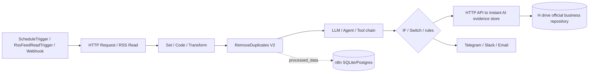

# n8n 真实数据流

> 项目/提交：`n8n-io/n8n` @ `7968432083cdc2526b3b08983d84d0dc73176356`。
> n8n 不规定新闻 schema；下图是用其真实节点与执行引擎映射出的财经情报候选流。
> 研究副本是官方提交归档，无 `.git`、不等于完成克隆；Windows 解压仅排除 `.claude`
> 开发辅助目录。

## 通用执行流

```text
触发（Schedule / RSS poll / Webhook / MCP / 手动）
 -> ActiveWorkflowManager 或 AbstractServer webhook handler
 -> WorkflowRunner.run：登记 execution、credential permission check
 -> regular 本进程 或 queue Redis/Bull worker
 -> WorkflowExecute：按 nodes + connections 构建/消费 nodeExecutionStack
 -> NodeTypes 解析版本并调用 execute / poll / trigger / webhook
 -> 通用 INodeExecutionData JSON/binary 沿连接传递
 -> lifecycle hooks 保存 execution/runData/staticData/binary
 -> REST/Editor 执行历史，或通知/API/Webhook 节点输出
```

## 对“即时 AI”的候选编排流



这里的 `N/A/G/O` 必须由 workflow 作者设计；n8n 源码没有财经规范化、实体识别、重要度评分或
证据表。正式证据保存必须调用“即时 AI”受控 API/adapter，不能把 n8n execution log 当正式库。

## 阶段证据

| 阶段 | 源码/标识符 | 行为与限制 | 状态 |
|---|---|---|---|
| RSS poll | `nodes-base/nodes/RssFeedRead/RssFeedReadTrigger.node.ts::poll` | 用 node staticData 的 `lastItemDate/lastTimeChecked`，返回更新项 | `SOURCE_VERIFIED` |
| RSS fetch | `.../RssFeedRead.node.ts::RssFeedRead.execute`、`GenericFunctions.parseFeedUrl` | URL → rss-parser 项目对象 | `SOURCE_VERIFIED` |
| HTTP | `nodes-base/nodes/HttpRequest/V3/HttpRequestV3.node.ts` | 通用请求节点；非财经专用 | `SOURCE_VERIFIED` |
| Schedule | `nodes-base/nodes/Schedule/ScheduleTrigger.node.ts::trigger` | cron/interval 注册；emit 带 workflow+node+scheduledTime 幂等键 | `SOURCE_VERIFIED` |
| Webhook | `abstract-server.ts::start` → `createWebhookHandlerFor` → `webhooks/webhook-helpers.ts` | 匹配 webhook，建立 workflow execution，处理 response mode | `SOURCE_VERIFIED` |
| 激活 | `active-workflow-manager.ts::add` | Webhook 入 `webhook_entity`；poll/trigger/schedule 进入 active trigger | `SOURCE_VERIFIED` |
| 登记执行 | `workflow-runner.ts::run` → `ActiveExecutions.add` | 先持久化 execution，再检查 credential permission | `SOURCE_VERIFIED` |
| 执行分流 | `WorkflowRunner.run` | regular 进 `runMainProcess`；queue 进 `enqueueExecution` | `SOURCE_VERIFIED` |
| 图执行 | `WorkflowExecute.run/processRunExecutionData` | node stack、等待输入、重试、continueOnFail、cancel、resultData | `SOURCE_VERIFIED` |
| 节点分派 | `WorkflowExecute.runNode` | `execute`/`poll`/`trigger`/`webhook`/declarative | `SOURCE_VERIFIED` |
| 去重 | `RemoveDuplicatesV2.execute` → `DataDeduplicationService` → `DeduplicationHelper` | 同批字段去重；跨次 hash/latest key/latest date；node/workflow scope | `SOURCE_VERIFIED` |
| AI | `@n8n/nodes-langchain/nodes/agents/**`、`llms/**` | 由 workflow 显式接模型、agent、tools；不是自动财经分析 | `SOURCE_VERIFIED` |
| MCP | `McpTrigger.webhook` / `McpServer`；`McpClient.execute` | workflow 暴露/调用 MCP tool，queue 有 relay 字段 | `SOURCE_VERIFIED` |
| 持久化 | `execution-entity.ts` + `execution-data.ts` | 状态/时间/索引与序列化 workflow snapshot/run data 分表 | `SOURCE_VERIFIED` |
| 通知 | `Telegram.node.ts`、`Slack.node.ts`、`EmailSend.node.ts` | 通用渠道执行节点；需凭据和外部服务 | `SOURCE_VERIFIED` |

## 去重边界

`DeduplicationHelper` 在 `processed_data` 按 workflowId 与 node context 保存 MD5(base64) 或 latest
值，`RemoveDuplicatesV2` 默认最大 history 10,000。它可做流程级重复抑制，但不是跨来源语义去重：
URL 规范化、标题相似度、正文指纹、公司/事件聚类仍需“即时 AI”自己的确定性与语义层。

## 证据与原文边界

n8n 会保留 workflow snapshot、node input/output、状态和 binary 数据（受 pruning/save settings
控制），但没有 source provenance、原文不可变快照、内容 hash/抓取政策等财经证据模型。因此
execution persistence 只能作为运行审计，不能作为 `H:\即时AI文件库\evidence` 的替代品。
